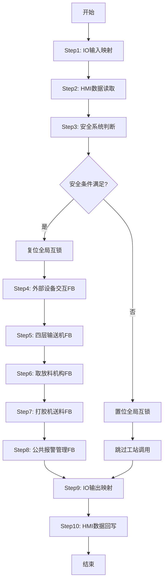

# OB1 主程序组织块详细设计说明书

## 1. 文档基础信息

| 属性 | 值 |
|------|-----|
| **文档标题** | OB1主程序组织块详细设计说明书 |
| **适用组件** | OB1 (主程序组织块) |
| **文档类型** | 详细设计说明书 / Design Specification (DSN) |
| **文档版本** | V9.1.0 |
| **编制日期** | 2026-05-18 |
| **编制人** | Trae |
| **审核人** | [待审核] |
| **遵循规范** | `LSP-905_SCL编程规范` |

---

## 2. 设计概述

### 2.1 设计目标

OB1作为主控程序，实现以下核心目标：
1. **集中式IO映射**：所有物理I/O地址集中管理
2. **工站调度**：按工艺顺序调用各功能块
3. **安全联锁**：统一的安全条件判断
4. **数据交互**：HMI和D区数据双向同步

### 2.2 架构设计

采用**扁平化组件架构 (V7.0.0 重构)**：
- **主控层**：OB1负责调度、IO映射、以及4层输送机的展开调用与汇总
- **功能块层**：各工站FB负责具体业务逻辑
  - Conveyor: 4×FB_1002 展开实例 (L1~L4), 内部委托 FB_1011(气缸) + FB_1012(电机)
  - PickPlace: 1×FB_1003
  - Feeder: 1×FB_1004
  - Alarm: 1×FB_2001
- **数据层**：GlobalVars.db存储全局状态

---

## 3. 程序流程设计

### 3.1 主循环流程



### 3.2 各步骤详细说明

| 步骤 | 名称 | 功能描述 | 执行逻辑 |
|:---:|------|----------|----------|
| 1 | IO输入映射 | 将X地址映射到M/D区 | X→M/D |
| 2 | HMI数据读取 | 读取HMI设定的参数 | M/D→内部变量 |
| 3 | 安全系统判断 | 检查急停/安全门/安全继电器 | AND逻辑判断 |
| 4 | 外部设备交互 | 调用FB_ExternalDeviceInteraction | 机器人/打胶机通信 |
| 5 | 四层输送机 | 展开调用4×FB_1002 + 汇总 | L1→L2→L3→L4 顺序调用, 然后OR/MIN汇总 |
| 6 | 取放料机构 | 调用FB_1003_PickPlace | Z/X1轴+双夹爪控制 |
| 7 | 打胶机送料 | 调用FB_1004_GlueMachineFeeder | X2轴+打胶机协作 |
| 8 | 公共报警管理 | 调用FB_2001_CommonAlarm | 报警汇聚+MES队列 |
| 9 | IO输出映射 | 将M/D区映射到Y地址 | M/D→Y |
| 10 | HMI数据回写 | 写入HMI显示数据 | 内部变量→M/D |

---

## 4. 功能块调用设计

### 4.1 调用顺序与依赖

```
FB_ExternalDeviceInteraction → 4×FB_1002(L1→L4) + 汇总 → FB_1003_PickPlace → FB_1004_GlueMachineFeeder → FB_2001_CommonAlarm
```

### 4.2 调用参数映射

| FB名称 | 输入来源 | 输出去向 |
|--------|----------|----------|
| FB_ExternalDeviceInteraction | GlobalVars.stExternal | GlobalVars.stExternal |
| FB_1002_L1~L4 (展开) | GlobalVars.stConveyor (逐层索引[1]~[4]) | GlobalVars.stConveyor (逐层索引) |
| FB_1003_PickPlace | GlobalVars.stPickPlace | GlobalVars.stPickPlace |
| FB_1004_GlueMachineFeeder | GlobalVars.stFeeder | GlobalVars.stFeeder |
| FB_2001_CommonAlarm | 各工站报警输出 | GlobalVars.stAlarm |

### 4.3 输送机展开调用与汇总设计 (V7.0.0新增)

```
┌─────────────────────────────────────────────────────────────┐
│ Step 5: 四层输送机展开调用 + 汇总                            │
│                                                              │
│ fbConveyor_L1(i_iLayerIndex:=1, ...)                         │
│   → stConveyor.q_aLayerRunning[1] / q_aLayerAlarmCode[1]    │
│                                                              │
│ fbConveyor_L2(i_iLayerIndex:=2, ...)                         │
│   → stConveyor.q_aLayerRunning[2] / q_aLayerAlarmCode[2]    │
│                                                              │
│ fbConveyor_L3(i_iLayerIndex:=3, ...)                         │
│   → stConveyor.q_aLayerRunning[3] / q_aLayerAlarmCode[3]    │
│                                                              │
│ fbConveyor_L4(i_iLayerIndex:=4, ...)                         │
│   → stConveyor.q_aLayerRunning[4] / q_aLayerAlarmCode[4]    │
│                                                              │
│ 汇总:                                                        │
│   q_bRunning := L1 OR L2 OR L3 OR L4                        │
│   q_bFault   := L1 OR L2 OR L3 OR L4                        │
│   q_iAlarmCode := MIN(非零报警码, 优先级越高值越小)          │
└─────────────────────────────────────────────────────────────┘
```

---

## 5. 安全系统设计

### 5.1 安全信号定义

| 信号名称 | 地址 | 类型 | 描述 |
|----------|------|------|------|
| 急停按钮 | X16 | DI | 常闭输入，按下为FALSE |
| 前安全门 | X14 | DI | 门关闭为TRUE |
| 后安全门 | X15 | DI | 门关闭为TRUE |
| 安全继电器输出 | Y13 | DO | 继电器吸合为TRUE |
| 全局互锁标志 | M200 | MB | 安全条件满足为TRUE |

### 5.2 安全联锁逻辑

```
M200 := NOT X16 AND X14 AND X15 AND Y13;

IF NOT M200 THEN
    // 安全条件不满足，停止所有工站
    fbConveyor4Layer.i_bEnable := FALSE;
    fbPickPlace.i_bEnable := FALSE;
    fbGlueMachineFeeder.i_bEnable := FALSE;
END_IF;
```

---

**文档版本**: V7.0.0  
**最后更新**: 2026-05-18