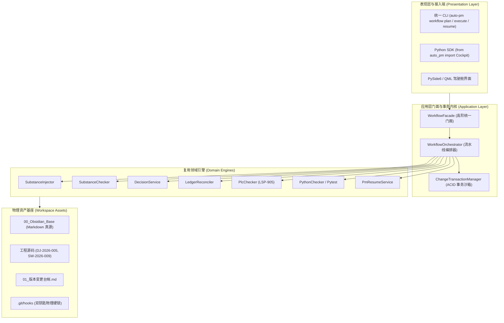

# Cockpit OS 大一统集成与超级特种兵架构方案 (WBS 分解)

> **版本**：V1.0.0  
> **编制日期**：2026-09-03  
> **核心目标**：彻底消除多智能体协作中“人肉公文传递”与“繁重手写表单”的摩擦，全面复用已有防空壳、物理硬锁、台账对账与双领域门禁资产，构建单兵全栈工程师作战外骨骼。  
> **执行约束**：**杜绝大爆炸式长任务**，所有 WBS 均拆解为独立、可原子验证、单步时长 <30 分钟的微迭代（Tiny Sprints）。

> **已解冻（2026-09-08，用户明确指令）**：`011_回归缺陷根因与修正WBS_PM.md` 的 REG-WP-02～13 已完成，CHG-SCPT-2026-188/189/190/191 已完成关闭，CHG-SCPT-2026-192 已登记并关闭门禁兼容缺陷；用户已明确授权验收并解冻。本 WBS 后续未完成任务恢复为“可按包报批、执行、验收”，不等于自动获得源码、发布、切流或清理授权。

> **2026-09-08 状态校准（PM 复核后）**：本文件 V1.0.0 是历史规划基线，**不是全部 Phase 完成证明，也不是稳定发布授权**。W0/C2-C3 已在研发母库完成批准范围内的 27 路径依赖闭包回收：`DEC-20260908-34F0A422`、`AI-20260908-144338-D09FC0BF` 已绑定并消费；pytest **45 passed**、Ruff/Mypy Exit 0、CLI help Exit 0，execution 无 `decision_id` 已 fail-closed。CHG-SCPT-2026-188 已完成用户验收并关闭；批准范围内提交已执行，稳定部署、发布、切流和清理仍未执行。因此，本 WBS 的“全部 Phase 完成”结论仍不成立。

> **修正边界**：Phase 0～3 仅能按实际文件、测试和 handoff 证据逐项确认；Phase 4 的 `auto_pm.api` / `Cockpit`、Phase 3 的 `WorkflowFacade` 与 CLI E2E 测试目标在当前稳定容器中未形成完整目标文件闭环；Phase 5 的 Python/PLC 活体演练和 Phase 6 的技能瘦身不能由候选测试或发布记录代替。后续应以 NG-WP 包、真实 CHG、源 Git diff、领域门禁和 PM 收口证据为准。

> **模型路由修正**：不因方案校准切换主控模型。架构裁决、差异消歧和最终验收由当前主控完成；`gpt-5.6-sol` 仅在对应 NG-WP 包获得批准后，执行精确路径范围内的编码、测试和证据整理，不得自行扩展范围、切流或关闭 CHG。

### 当前校准映射（2026-09-08）

| 本文件 Phase | 当前结论 | 不能直接宣称完成的原因 | 下一合法动作 |
|---|---|---|---|
| Phase 0～2 | 部分资产存在 | 文件存在不等于对应验收命令、测试回执和 PM 收口已完成 | 逐包绑定 NG-WP、CHG、测试输出和 `handoff_result` |
| Phase 3 | 未闭环 | `WorkflowFacade` 与 CLI E2E 测试目标未形成完整文件闭环 | 先确认现行 NG-WP 是否仍需要这些接口，再单独报批实现包 |
| Phase 4 | 未闭环 | `auto_pm.api` / `Cockpit` 目标文件当前未形成完整文件闭环 | 不以架构描述代替 SDK 冒烟证据 |
| Phase 5 | 未验收 | 真实 Python/PLC 活体演练、Git 双硬锁复测缺少本 WBS 对应的完整验收包 | 由 PM 收口后重新建立受控 dogfood 包 |
| Phase 6 | 未验收 | 技能瘦身涉及全局协同规则，不能用局部文档变更代替全量门禁 | 另立文档/技能变更单，完成死链与规则门禁 |

**校准结论**：本文件保留为“架构意图与历史拆分基线”；当前执行主线改由 `pm resume` 输出、现行 NG-WP、真实 CHG/DEC、源 Git 差异、领域门禁及 PM 收口记录共同决定。旧 Phase 编号不得单独作为实现状态或发布授权。

**W0 母库复核证据（2026-09-08）**：在研发母库运行批准范围内的 6 组测试，结果为 **45 passed**；Ruff、Mypy、CLI help 和 execution 缺少决策包的 fail-closed 负向验证均通过；CHG-SCPT-2026-188 已完成用户验收并关闭。该结果证明 W0 已完成批准范围的实现与验收，不证明稳定发布或全 Phase 完成。

**真源边界补充**：本次 45 项测试针对研发母体 `SW-2026-008/auto_pm` 的 27 个批准路径；候选容器仅作为来源证据，未被切流或覆盖。Phase 3～6 的其他架构目标仍需独立证据，不能由本次 W0 回收结果外推为全方案完成。

**后续执行入口**：2026-09-08 解冻后，后续迭代按研发母体 `02_规划/010_Cockpit_OS_后续原子迭代WBS_PM.md` 的 `NG-WP-19`～`NG-WP-48` 逐包报批、执行和验收；本历史 WBS 作为架构基线继续保留，不单独构成实施授权。

---

## 一、 战略背景与核心痛点透视

### 1. 为什么当前协作“太麻烦”？
当前多智能体协作中，完成一次 3 行代码的小变更需要串联 12~14 个离散步骤：
```text
创建变更单 ➔ 提报决策包 ➔ 准备 Handoff Payload ➔ 唤醒子代理 ➔ 子代理 claim ➔ 子代理 start 
➔ 改代码 ➔ 跑测试 ➔ 跑门禁 ➔ 手写 30 行带 change_substance 的 result.json ➔ result-submit 
➔ 主 Agent consume ➔ 手动修改 CHG-xxx.md ➔ 手动回写 PM_SESSION ➔ 跑 ledger reconcile ➔ Git 提交
```
- **智能体沦为“表单秘书”**：大量心智与 Token 消耗在手写 JSON、回写 Markdown 单据、手工平账上；
- **单点阻断率高**：手写 `result.json` 缺少一个字段即被门禁无情打回；
- **提示词脆弱性**：依靠 Prompt 约束多智能体遵守几十项格式要求，不仅吞噬上下文，且极易因模型幻觉断链。

### 2. Cockpit OS 质变逻辑
**不是推翻重来，而是“把机械式的公文流转下沉为 Python 底层原子事务”**：
- **特种兵的极简心智**：工程师或单 Agent 仅需专注实现业务代码；
- **外骨骼一键闭环**：通过高阶 Facade（`plan` / `execute` / `resume`），由驾驶舱底层自动比对 Git Diff、动态绑定 Obsidian 规范、自动注入实质证据、自动平账并过 Git 物理硬锁。

---

## 二、 现有资产复用矩阵（坚决不重复造轮子）

本方案**100% 建立在现有已验证的工业级资产之上**，严禁另起炉灶：

| 现有资产模块 | 物理文件位置 | 现有成熟能力 | 在 Cockpit OS 中的复用方式 |
| :--- | :--- | :--- | :--- |
| **SubstanceChecker** | `auto_pm/domain/change/substance_checker.py` | 占位符黑名单过滤、变更四段式实质检验、跨领域单据穿透校验 | 复用为 `execute` 阶段的**物理防伪关卡**，未过关直接阻断并回滚。 |
| **SubstanceInjector** | `auto_pm/domain/change/substance_injector.py` | 自动将结构化数据物理回填进 Markdown 并擦除占位符 | 复用为 `execute` 阶段的**自动证据注射器**，免去人工手写表单。 |
| **Git 物理硬锁** | `.git/hooks/pre-commit`<br/>`.git/hooks/commit-msg` | `pre-commit` 校验台账 0 差异，`commit-msg` 校验提交必绑合法变更单 | 保留为**最底层的安全兜底网**，任何上层接口必须天然满足硬锁约束。 |
| **DecisionPackage** | `auto_pm/contracts/decision_package.py`<br/>`auto_pm/domain/change/decision_service.py` | 阶段 1 结构化决策包生成与固化契约 | 复用为 `plan` 阶段的**决策输出标准模型**。 |
| **LedgerReconciler** | `auto_pm/domain/change/ledger_reconciler.py`<br/>`auto_pm/domain/change/ledger_updater.py` | 扫描 CHG 文件与台账，检测 3 类差异并执行 `auto_fix` 自动平账 | 复用为 `execute` 阶段的**自动对账回调**，提交前硬保证 0 差异。 |
| **PmResumeService** | `auto_pm/application/core/pm_resume_service.py`<br/>`auto_pm/application/core/project_fact_service.py` | 提取全局事实指纹、活跃变更单、Git HEAD，0 幻觉冷启动 | 复用为 `resume` 阶段的**战场态势即时投影引擎**。 |
| **双领域质检门禁** | `auto_pm/plc/checker.py`<br/>`auto_pm/ui/cli/python/__init__.py` | PLC 语法白名单、LSP-905 规则；Python 210/211/220 规范与 pytest | 复用为工作流的**领域自动化测试插槽**。 |
| **Obsidian 规范真源** | `00_Obsidian_Base全局规范文件仓库/spec_registry.json` | 集中管理全局法典元数据与路径映射 | 保持为**外部只读 Single Source of Truth**，动态索引。 |
| **Clean Architecture** | `auto_pm` 现有 5 层整洁架构 (contracts/domain/infra/app/ui) | 强类型 DTO、服务解耦、表现层与领域层分离 | 严格沿用分层，新模块精准归位，**严禁破坏架构层级**。 |

---

## 三、 目标架构蓝图与高阶公共 API 契约



### 3 大原子高阶接口定义

#### 1. 方案报批：`auto-pm workflow plan`
- **CLI 语法**：
  ```powershell
  python -m auto_pm workflow plan -p <PID> -t <TITLE> [--type OPT] [--domain SCPT|PLC] [--json]
  ```
- **原子动作**：检查项目存在性 ➔ 自动获取/生成草稿变更单 ➔ 动态绑定 Obsidian 规范 ➔ 输出紧凑决策包 ➔ 在 `PM_SESSION` 登记意图。

#### 2. 单兵执行闭环：`auto-pm workflow execute`
- **CLI 语法**：
  ```powershell
  python -m auto_pm workflow execute -p <PID> -c <CHG-NUM> [--commit] [-m <COMMIT_MSG>] [--verify-only]
  ```
- **原子动作**：开启 ACID 事务备份 ➔ 自动抓取 Git Diff 涉及文件 ➔ `SubstanceInjector` 自动注入实质数据 ➔ `SubstanceChecker` 防空壳核验 ➔ 执行领域门禁（PLC Linter 或 pytest） ➔ 单据状态流转至 `completed` ➔ `LedgerReconciler.auto_fix` 强制平账（0 差异） ➔ 回写 `PM_SESSION` ➔ （可选 `--commit`）组织标准信息并通过 Git 物理硬锁。若任何一步失败，**自动回滚还原所有文件**。

#### 3. 战场态势秒级感知：`auto-pm workflow resume`
- **CLI 语法**：
  ```powershell
  python -m auto_pm workflow resume [PID] [--json]
  ```
- **原子动作**：调用 `PmResumeService` 输出全局事实指纹、当前活跃变更、台账差异与 Git HEAD，新 Agent 1 秒恢复记忆。

---

## 四、 细颗粒度 WBS 工作分解结构（杜绝长任务）

每个 WBS 单元均设定为**独立微任务（<30分钟）**，并明确物理验收命令与断言，全部通过后方可推进下一项。

### Phase 0: 契约层与 DTO 纯净定义 (Contracts Layer)
> **目标**：建立高阶工作流所需的入参和出参强类型 DTO，无任何外部副作用。

#### 【WBS 0.1】新增工作流强类型契约
- **目标文件**：`00_Infrastructure/auto_pm/auto_pm/contracts/workflow_dtos.py`
- **依赖资产**：无
- **任务内容**：定义 `WorkflowPlanRequestDTO`、`WorkflowPlanResultDTO`、`WorkflowExecuteRequestDTO`、`WorkflowExecuteResultDTO`、`WorkflowResumeDTO` 及 `TransactionStatus` 枚举。
- **验收命令**：
  ```powershell
  & .\.venv\Scripts\python.exe -c "from auto_pm.contracts.workflow_dtos import WorkflowPlanRequestDTO, WorkflowExecuteRequestDTO; print('DTO load OK')"
  ```
- **预期断言**：Exit Code 0，打印 `DTO load OK`。

---

### Phase 1: 变更事务沙箱与 ACID 管理器 (Transaction Engine)
> **目标**：实现变更生命周期的防灾与回滚机制，防止生成半成品脏数据。

#### 【WBS 1.1】落地 ChangeTransaction 与 TransactionManager
- **目标文件**：`00_Infrastructure/auto_pm/auto_pm/application/core/change_transaction.py`
- **依赖资产**：`auto_pm.logging.audit`
- **任务内容**：
  1. `backup_file(path)`：修改前保存原文件快照；
  2. `track_created_file(path)`：登记新创建文件；
  3. `rollback(reason)`：恢复备份文件、物理销毁新建文件、记录审计日志；
  4. `commit()`：清理临时快照、原子确认；
  5. 封装上下文管理器 `__enter__` / `__exit__`。
- **验收命令**：
  ```powershell
  & .\.venv\Scripts\python.exe -c "from auto_pm.application.core.change_transaction import ChangeTransactionManager; tm = ChangeTransactionManager('.'); tx = tm.begin('TEST-001', 'CHG-TEST-001'); print('TX status:', tx.status)"
  ```
- **预期断言**：Exit Code 0，打印 `TX status: TransactionStatus.ACTIVE`。

#### 【WBS 1.2】编写事务管理器自动化回滚单测
- **目标文件**：`00_Infrastructure/auto_pm/tests/application/test_change_transaction.py`
- **任务内容**：在 `tmp_path` 隔离环境中模拟文件修改、文件新建、异常抛出，断言 `rollback()` 后旧文件内容 100% 还原、新建文件被物理删除。
- **验收命令**：
  ```powershell
  & .\.venv\Scripts\python.exe -m pytest 00_Infrastructure/auto_pm/tests/application/test_change_transaction.py
  ```
- **预期断言**：全量测试 100% 通过（PASSED）。

---

### Phase 2: 工作流编排内核流水线 (Orchestrator Core)
> **目标**：将离散的现有资产（SubstanceInjector、LedgerReconciler 等）无缝串接成流水线。

#### 【WBS 2.1】落地 WorkflowOrchestrator.plan 方案流水线
- **目标文件**：`00_Infrastructure/auto_pm/auto_pm/application/core/workflow_orchestrator.py`
- **依赖资产**：`ChangeService`, `DecisionService`, `ProjectService`, `spec_registry.json`
- **任务内容**：
  1. 验证目标项目有效性；
  2. 匹配已有草稿单或调用 `ChangeService.create_change_request`；
  3. 按照领域自动关联 Obsidian 规范（如 PLC 关联 LSP-905/STD-830，SCPT 关联 DEV-300）；
  4. 组织决策包载荷并在 `PM_SESSION.md` 登记。
- **验收命令**：
  ```powershell
  & .\.venv\Scripts\python.exe -c "from auto_pm.application.core.workflow_orchestrator import WorkflowOrchestrator; print('Orchestrator ready')"
  ```
- **预期断言**：Exit Code 0。

#### 【WBS 2.2】落地 WorkflowOrchestrator.execute 执行流水线
- **目标文件**：`00_Infrastructure/auto_pm/auto_pm/application/core/workflow_orchestrator.py`
- **依赖资产**：`ChangeTransactionManager`, `SubstanceInjector`, `SubstanceChecker`, `LedgerReconciler`, `PlcChecker`, `pytest`
- **任务内容**：
  1. 接入事务沙箱备份单据、台账与会话文件；
  2. Git Diff 自动扫描变更文件；
  3. 调用 `SubstanceInjector.inject` 注入变更实质；
  4. 调用 `SubstanceChecker.check_substance` 确保 0 占位符；
  5. 执行领域自检；
  6. 流转单据状态至 completed；
  7. 调用 `LedgerReconciler.auto_fix` 自动平账并确认 `is_clean == True`；
  8. 回写 `PM_SESSION`；
  9. （若指定 `--commit`）原子调用 `git commit` 并挂载合法单号通过物理硬锁。
- **验收命令**：在只读沙箱下运行单元测试验证链路通畅。

#### 【WBS 2.3】落地 WorkflowOrchestrator.resume 战场态势流水线
- **目标文件**：`00_Infrastructure/auto_pm/auto_pm/application/core/workflow_orchestrator.py`
- **依赖资产**：`PmResumeService`, `LedgerReconciler`
- **任务内容**：提取项目指纹、活跃变更、台账差异与 Git HEAD 并结构化输出。
- **验收命令**：
  ```powershell
  & .\.venv\Scripts\python.exe -c "from auto_pm.application.core.workflow_orchestrator import WorkflowOrchestrator; orch = WorkflowOrchestrator('.'); res = orch.resume('SW-2026-008'); print('Fingerprint:', res.fact_fingerprint)"
  ```
- **预期断言**：Exit Code 0，打印有效指纹字符串。

#### 【WBS 2.4】编写编排器单元测试集
- **目标文件**：`00_Infrastructure/auto_pm/tests/application/test_workflow_orchestrator.py`
- **任务内容**：在独立测试夹具中覆盖 `plan`、`execute (verify_only)`、`resume` 的调用逻辑与异常断言。
- **验收命令**：
  ```powershell
  & .\.venv\Scripts\python.exe -m pytest 00_Infrastructure/auto_pm/tests/application/test_workflow_orchestrator.py
  ```
- **预期断言**：全量测试 100% 通过（PASSED）。

---

### Phase 3: 表现层 Facade 与 CLI 高阶命令 (Presentation & CLI)
> **目标**：对外公开友好、高可读的 CLI 命令与 Facade 接口。

#### 【WBS 3.1】落地 WorkflowFacade 统一门面
- **目标文件**：`00_Infrastructure/auto_pm/auto_pm/application/workflow_facade.py`
- **依赖资产**：`WorkflowOrchestrator`, `CommandResult`, `QueryResult`
- **任务内容**：将编排器方法包装为返回标准 `CommandResult` / `QueryResult` 的 Facade 接口。
- **验收命令**：
  ```powershell
  & .\.venv\Scripts\python.exe -c "from auto_pm.application.workflow_facade import WorkflowFacade; f = WorkflowFacade(); print('Facade ready')"
  ```
- **预期断言**：Exit Code 0。

#### 【WBS 3.2】扩展 auto-pm workflow CLI 命令集
- **目标文件**：`00_Infrastructure/auto_pm/auto_pm/ui/cli/workflow.py`
- **依赖资产**：`WorkflowOrchestrator`, `rich.console`, `rich.table`
- **任务内容**：
  1. 注册 `auto-pm workflow plan`（支持 `--project`, `--title`, `--type`, `--domain`, `--json`）；
  2. 注册 `auto-pm workflow execute`（支持 `--project`, `--change-id`, `--commit`, `--verify-only`, `--json`）；
  3. 注册 `auto-pm workflow resume`（支持 `[project_id]`, `--json`）；
  4. 严格保留现有的 `list`, `run`, `status`, `history` 约束工作流命令（向后兼容）。
- **验收命令**：
  ```powershell
  & .\.venv\Scripts\python.exe -m auto_pm workflow --help
  ```
- **预期断言**：帮助文档中清晰列出 `execute`, `plan`, `resume` 等所有命令，Exit Code 0。

#### 【WBS 3.3】编写 CLI 命令行端到端测试
- **目标文件**：`00_Infrastructure/auto_pm/tests/cli/test_workflow_commands.py`
- **任务内容**：使用 `click.testing.CliRunner` 测试 `workflow --help`、`workflow resume --json` 等命令的输出格式与退出码。
- **验收命令**：
  ```powershell
  & .\.venv\Scripts\python.exe -m pytest 00_Infrastructure/auto_pm/tests/cli/test_workflow_commands.py
  ```
- **预期断言**：全量测试 100% 通过（PASSED）。

---

### Phase 4: 统一 Python SDK 导出 (SDK Entrypoint)
> **目标**：提供一行导入的纯净 Python SDK，供高级特种兵脚本或外部插件调用。

#### 【WBS 4.1】构建 auto_pm.api 与 Cockpit 导出
- **目标文件**：
  - `00_Infrastructure/auto_pm/auto_pm/api.py`
  - `00_Infrastructure/auto_pm/auto_pm/__init__.py`
- **任务内容**：提供 `from auto_pm import Cockpit`，支持 `with Cockpit() as app:` 上下文管理器。
- **验收命令**：
  ```powershell
  & .\.venv\Scripts\python.exe -c "from auto_pm import Cockpit; app = Cockpit('.'); print('Cockpit SDK OK')"
  ```
- **预期断言**：Exit Code 0，打印 `Cockpit SDK OK`。

---

### Phase 5: 真实活体工程实弹演练与物理硬锁复测 (Live Dogfooding)
> **目标**：在真实在研项目中用 2 步闭环完成一次变更，并进行破坏性防线复测。

#### 【WBS 5.1】Python 在研项目活体实测 (SW-2026-009)
- **目标工程**：`SW-2026-009_英语学习助手`
- **演练步骤**：
  1. 运行 `auto-pm workflow plan -p SW-2026-009 -t "SDK与高阶接口活体联动测试" --domain SCPT`；
  2. 微调 `tests/test_services.py` 增加一个断言；
  3. 运行 `auto-pm workflow execute -p SW-2026-009 -c <CHG_ID> --commit -m "test: 验证单兵一键闭环"`；
  4. 检查 Git log 确认提交成功并带有合法变更单号。
- **验收命令**：
  ```powershell
  & .\.venv\Scripts\python.exe -m auto_pm -w . ledger reconcile SW-2026-009
  ```
- **预期断言**：台账对账报告显示 `✅ 对账无差异`，Exit Code 0。

#### 【WBS 5.2】PLC 在研项目活体实测 (DJ-2026-005)
- **目标工程**：`0100_PLC自动化/DJ-2026-005`
- **演练步骤**：
  1. 运行 `auto-pm workflow plan -p DJ-2026-005 -t "PLC单兵外骨骼实测" --domain PLC`；
  2. 运行 `auto-pm workflow execute -p DJ-2026-005 -c <CHG_ID> --verify-only`；
  3. 确认 PLC Linter 与门禁自检全部放行。
- **验收命令**：
  ```powershell
  & .\.venv\Scripts\python.exe -m auto_pm -w . plc check DJ-2026-005
  ```
- **预期断言**：Pass=51, Warn=0, Fail=0，Exit Code 0。

#### 【WBS 5.3】破坏性物理硬锁防线复查
- **测试场景**：
  1. 故意制造台账不一致，执行 `git commit`，断言被 `pre-commit` 物理硬锁拦截（Exit Code 1）；
  2. 故意使用伪造的单号提交代码，断言被 `commit-msg` 物理硬锁拦截（Exit Code 1）；
  3. 确认双钥匙硬锁没有任何松动或被绕过。

---

### Phase 6: 规范文档与 AI 技能库极简瘦身 (Governance & Skinny Skills)
> **目标**：将 `.trae/skills/` 与 `.agents/` 中繁琐的公文传递规则删除，换成 20 行高阶外骨骼调用说明。

#### 【WBS 6.1】更新 AGENTS.md 与工作区全局规则
- **目标文件**：`AGENTS.md`, `.agents/rules/subagent_handoff.md`
- **任务内容**：补充 Cockpit OS 高阶工作流使用规范，废除强制手写 30 行 `result.json` 的旧规约。
- **验收命令**：文档扫描无死链。

#### 【WBS 6.2】技能定义瘦身 (Slimming down Skills)
- **目标文件**：`.trae/skills/pm-workflow/SKILL.md`, `.trae/skills/fullstack-engineer/SKILL.md`, `.trae/skills/plc-electrical-engineer/SKILL.md`
- **任务内容**：剔除冗长的人肉表单回写 SOP，直接保留高阶 `auto-pm workflow` 命令示例。

---

## 五、 实施计划甘特图与门禁控制表

```text
[Phase 0: 纯净 DTO 契约] ─────────► (Exit Code 0, 无副作用)
            │
            ▼
[Phase 1: ACID 事务沙箱] ─────────► (单测验证异常时 100% 还原)
            │
            ▼
[Phase 2: 编排器流水线] ──────────► (串联 SubstanceInjector/Reconciler 门禁全绿)
            │
            ▼
[Phase 3: Facade 与 CLI 命令] ────► (Click CliRunner 端到端全绿)
            │
            ▼
[Phase 4: Python SDK 导出] ───────► (import auto_pm.Cockpit 冒烟通过)
            │
            ▼
[Phase 5: 双技术栈活体实弹演练] ──► (SW-2026-009 与 DJ-2026-005 真实落账，Git 硬锁双向拦截通过)
            │
            ▼
[Phase 6: 技能与规范瘦身收口] ────► (删除繁琐公文流转，特种兵武器库正式结项)
```

---

## 六、 总结与结项承诺

1. **绝对防长任务**：每个 WBS 单元均已切分为原子微任务，执行时限控制在 15~30 分钟内，且每个任务均有清晰物理 Exit Code 验证命令；
2. **绝对资产复用**：`SubstanceChecker`、`SubstanceInjector`、`LedgerReconciler`、`.git/hooks` 物理硬锁全部作为核心构件被直接组装，原样保留其防御威力；
3. **彻底根治繁琐**：方案落地后，单次变更操作步数从现有的 **12 步降低至 2 步**，AI 与用户彻底摆脱手写表单负担；
4. **决策权归属**：本方案文件已持久化输出至工作区根目录 [`Cockpit_OS_大一统集成与超级特种兵架构方案_WBS.md`](file:///c:/Users/fubai/Documents/My_Workspace/Cockpit_OS_大一统集成与超级特种兵架构方案_WBS.md)。**未得到您在对话框明确回复“同意方案，启动 Phase X”之前，绝不擅自执行任何修改！**
