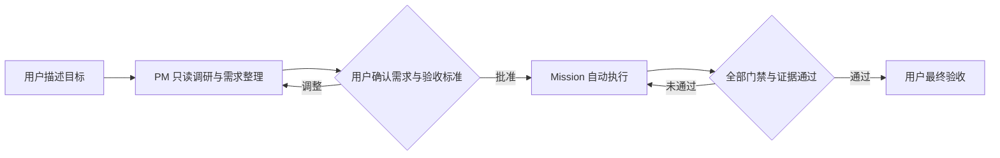
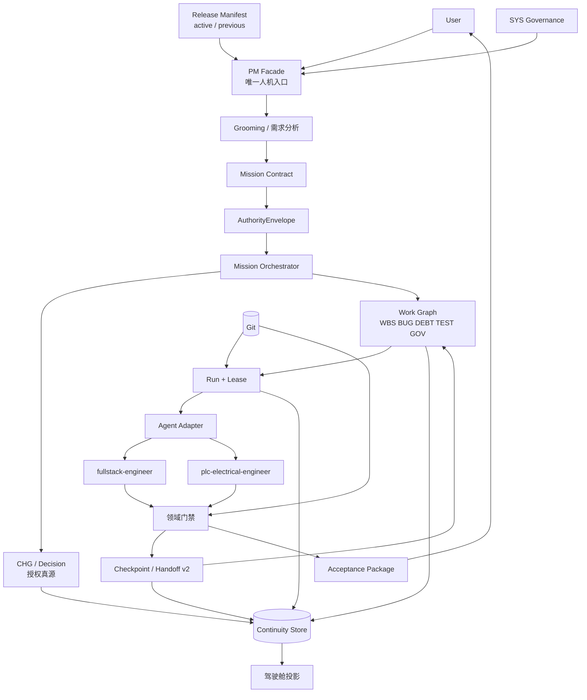
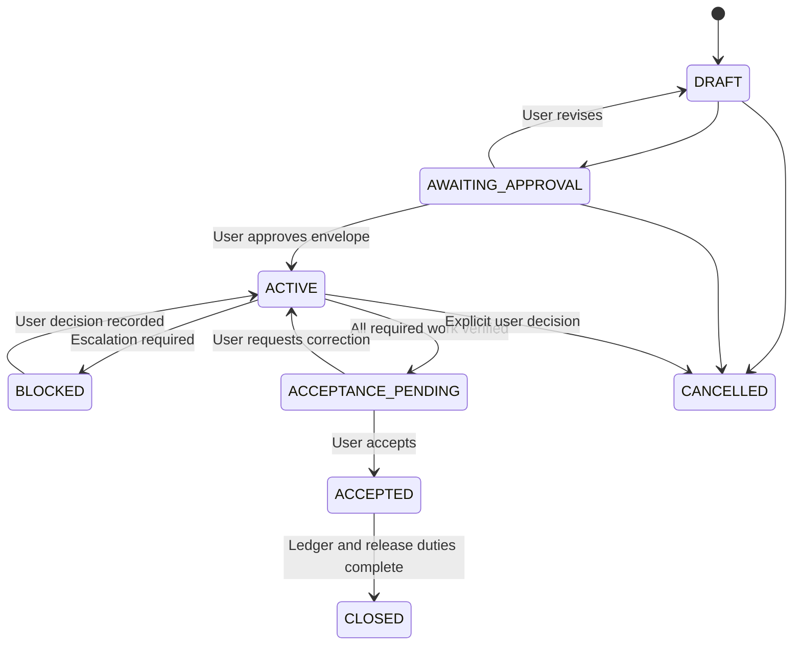
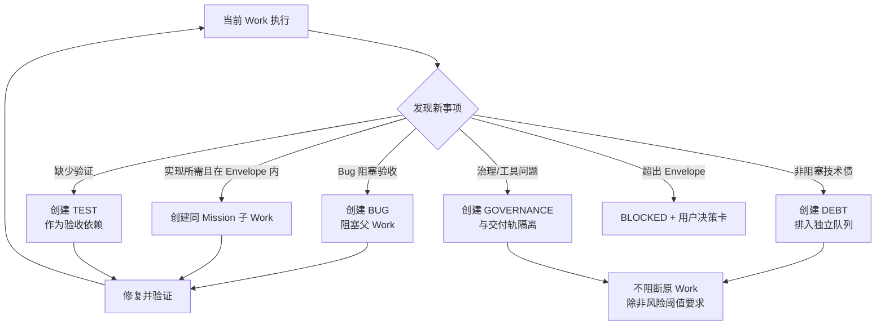
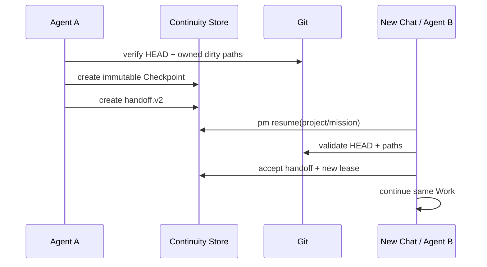

# Cockpit OS 超级特种兵大一统目标架构与迁移总方案

> 文档状态：`TARGET_BASELINE / A0_ACCEPTED / CHG-199_CLOSED / NOT_DEPLOYED`
> 编制日期：2026-09-09
> 决策人：User（fubai）
> 治理主线：`CHG-SCPT-2026-198`
> 批准包：`DEC-20260910-5EE749DF`
> 当前工作：`WORK-SW008-A0-198`
> 当前运行：`RUN-SW008-A0-198-01`
> 研发母体：`SW-2026-008`
> 稳定部署：`00_Infrastructure/auto_pm`
> 运行状态：根目录 `.auto-pm`
> 治理真源：`SYS-2026-001_WorkspaceGovernance`

权威关系：治理规则与执行边界以 `26_SW-2026-008_治理恢复与连续性重基线总计划_PM.md` 为先；本文是后续产品目标与迁移路线的唯一活动总方案，但不单独授权 A1～A7 实施；归档的 `Cockpit_OS_大一统集成与超级特种兵架构方案_WBS.md` 仅作历史意图和证据，不再提供当前状态或执行权。

## 1. 本方案解决什么

本方案把驾驶舱建设成用户的一站式工程 PM 和执行控制面。用户只负责两件事：

1. 在 PM 完成只读调研后，确认目标、边界和验收标准；
2. 在系统完成实现、验证和证据整理后，进行最终验收。

需求拆分、任务分类、Bug 转向、技术债登记、分支或工作树安排、执行 Agent 选择、失败重试、Checkpoint、跨对话接力、门禁和台账对账，均由驾驶舱在已批准权限内自动处理。只有真实业务选择、安全边界、超出批准范围或不可逆外部动作才再次打扰用户。

这不是恢复已退役的旧技能，而是把“PM”建设为驾驶舱的稳定业务门面。`pm-workflow` 名称可以作为面向用户的兼容叫法或入口别名保留，但旧 `.trae/skills/pm-workflow` 继续 `QUARANTINED / DECOMMISSIONED`，不得读取、注册或成为状态拥有者。

## 2. 用户体验目标

### 2.1 用户看到的最短流程



用户无需理解 CHG、Decision、Work、Run、lease、分支名、Agent 名称或测试命令。它们仍然存在，但属于系统内部的安全结构，而不是用户的操作负担。

### 2.2 默认不再询问用户的事项

- 将需求拆成 WBS、BUG、DEBT、TEST 或 GOVERNANCE 子工作；
- 在已批准文件和项目边界内调整实现顺序；
- 因测试失败创建修复子工作并回到原任务；
- 在同一 Mission 内切换执行 Agent、创建 Checkpoint 或 handoff.v2；
- 按既定策略创建临时分支或隔离工作树；
- 对失败步骤进行有上限的自动修复和重试；
- 运行测试、静态检查、文档检查和台账对账；
- 汇总中间进度，仅在需要用户决策时提示。

### 2.3 必须升级给用户的事项

- 新增或改变真实硬件、IO、轴系、工艺节拍、安全回路或现场风险；
- 需求目标、验收标准、交付范围或业务线发生实质变化；
- 需要修改 AuthorityEnvelope 以外的项目、路径、规范或发布目标；
- 删除、覆盖、强制回退、生产切流、外部发送、采购或其他不可逆动作；
- 两个有效方案存在用户价值取舍，代码和规范无法推导唯一答案；
- 有界修复耗尽、证据互相冲突、基线漂移或安全门禁失败关闭。

## 3. 当前真实基线（As-Is）

| 层级 | 当前真源 | 当前能力 | 已知缺口 |
|---|---|---|---|
| 治理 | SYS-2026-001 文档、CHG、Decision | 已有治理基线和审批链 | 历史方案较多，容易把计划误认成现状 |
| 研发 | SW-2026-008 | auto-pm 源码、测试、模板 | 尚无 Mission/AuthorityEnvelope 执行服务 |
| 稳定运行 | `00_Infrastructure/auto_pm/releases` + active/previous | 根 `main.py` 可解析 active release | Git hook 生成器仍可能绕过根入口加载旧平铺包 |
| 连续性 | 根 `.auto-pm/continuity.db` | Work、Run、Checkpoint、lease、handoff.v2 | 读取连接可能产生 SQLite WAL/SHM 副作用；尚无 Mission 聚合 |
| 项目摘要 | `PM_SESSION_*.md` | 人工可读投影 | 不能作为授权或执行队列真源 |
| 执行适配 | Agent skills + Continuity v2 | Python/PLC 执行边界已定义 | PM 门面尚未自动编排全部内部步骤 |
| 用户界面 | CLI/QML 驾驶舱 | 可浏览和执行部分命令 | 尚未形成“只确认两次”的 Mission 视图 |

当前已确认的优先风险：

1. Git hooks 可通过 `PYTHONPATH=00_Infrastructure/auto_pm` 加载旧平铺 1.2.4，而正常入口运行 active 1.3.3，形成双运行时判断；
2. Continuity 纯读取使用普通 SQLite 连接，严格只读操作可能创建、清理或改变 `-wal/-shm` 侧文件；
3. Work/Run 模型可以恢复执行，但缺少把“用户批准的一整个目标”长期封装起来的 Mission 与 AuthorityEnvelope；
4. 用户仍可能被内部 CHG、Work、Run、分支和 Agent 调度细节拖入日常操作。

## 4. 目标架构（To-Be）



### 4.1 分层职责

| 层 | 职责 | 不允许承担的职责 |
|---|---|---|
| PM Facade | 面向用户收需求、展示确认卡、呈交验收 | 不私存执行状态，不绕过授权链 |
| Mission | 保存一个用户目标、验收条件和总体状态 | 不持有 Agent lease，不直接改代码 |
| AuthorityEnvelope | 定义系统可自主处理的最大权限边界 | 不默认为全工作区授权，不包含口头隐含权限 |
| Mission Orchestrator | 分类、拆 Work 图、路由、重试、升级 | 不扩大 Envelope，不替代领域门禁 |
| Work/Run | 保存原子工作及每次执行尝试 | 不替代用户目标或批准决策 |
| Agent Adapter | 把同一执行契约交给不同 Agent/IDE | 不建立平行账本，不写 PM_SESSION 队列 |
| Gate/Acceptance | 用机器证据判定完成并生成验收包 | 不以聊天回执代替 Exit Code 和文件证据 |

## 5. Mission 与 AuthorityEnvelope

### 5.1 Mission 是什么

Mission 是“一次用户批准的完整业务目标”，生命周期长于单个对话、Agent、分支和 Run。建议状态机：



Mission 至少包含：

- `mission_id`、`subject_project_id`、标题和用户目标；
- 可机器检查的验收标准；
- AuthorityEnvelope；
- 关联 CHG/Decision、根 Work 和 Work Graph；
- 当前状态、阻塞原因、风险、最终验收记录；
- 创建/更新时间、版本和审计引用。

### 5.2 AuthorityEnvelope 是什么

AuthorityEnvelope 是用户批准后授予驾驶舱的“内部自主处理边界”，必须显式、可验证、默认拒绝。至少表达：

- 允许的项目、路径和变更单/决策引用；
- 允许自动创建的 Work 类型；
- 是否允许内部重排、建立依赖、创建修复分支或隔离工作树；
- 是否允许在同一业务线内切换实现策略；
- 允许的执行适配器和并发上限；
- 禁止的外部副作用和不可逆动作；
- 必须升级给用户的触发条件；
- 有效期、版本、签发者和审计字段。

Envelope 不保存 lease token；聊天文字、PM_SESSION、旧 handoff 和旧技能都不能自动扩大它。

## 6. 自动分类与转向规则



默认策略：

- Bug 若导致当前验收标准失败，自动成为父 Work 的阻塞依赖；
- 技术债仅在安全、数据损坏、重复故障或当前门禁失败时阻塞，否则登记后回到主线；
- 治理和工具 Work 使用独立 track、分支/工作树和 Checkpoint，不污染被冻结的产品发布路线；
- 业务线切换只有在目标与验收标准不变、且 Envelope 明确允许时可内部完成；否则升级；
- 自动修复必须有次数、时间和变更规模上限，耗尽后失败关闭，不无限循环。

## 7. 分支、工作树与 Agent 策略

用户不需要选择分支或 Agent。驾驶舱根据风险自动决定：

| 情况 | 默认策略 |
|---|---|
| 单项目、少量文件、owned paths 干净 | 当前受控工作树内精确路径执行 |
| 已有无关 dirty 或需并行 | 创建隔离 worktree，分支前缀 `codex/` |
| Bug 打断当前实现 | 同 Mission 建修复子 Work；高耦合则同分支，低耦合则隔离分支 |
| Python/QML | `fullstack-engineer` |
| PLC/SCL | `plc-electrical-engineer` |
| 跨 IT/OT | 两个执行 Work 通过 INT 契约连接，PM 负责依赖顺序和联合验收 |
| Agent 中断或更换 | 先 Checkpoint，再创建并接受 handoff.v2，转移 lease 后继续 |

禁止自动执行 `git add .`、全仓格式化、reset/clean/stash 他人改动、强推或发布切流。

## 8. 跨对话和跨 Agent 接力

新对话不得依赖旧聊天摘要作为执行真源。恢复顺序固定为：

1. 读取根 `AGENTS.md`；
2. 读取治理基线文档 `26`、日常手册 `36` 和本总方案 `37`；
3. 从工作区根执行 `main.py pm resume <PID> --json`；
4. 若返回 Mission（A1 后）、Work、Run、Checkpoint 和 lease，则核对 Decision、owned paths、Git HEAD、dirty paths 与过期状态；
5. 原执行者继续时校验 lease；更换执行者时接受 checkpoint-bound handoff.v2 并获得新 lease；
6. 任何不一致均失败关闭，只向用户呈交一个清晰的决策卡，不要求用户手工拼接上下文。



新对话最短口令仍可使用：

> 在 My_Workspace 继续 `<PID>`。请从根入口恢复当前 Mission；我只处理必要决策和最终验收，其余按 AuthorityEnvelope 自动推进。

在 A1 尚未完成前，`WORK-SW008-A0-198` 和 `RUN-SW008-A0-198-01` 是本次 A0 的恢复锚点。

## 9. 数据真源和投影

| 对象 | 唯一真源 | 可重建投影 |
|---|---|---|
| 用户授权 | CHG + Decision + AuthorityEnvelope | 确认卡、报告 |
| Mission/Work/Run/Event | 根 `.auto-pm/continuity.db` | 驾驶舱列表、图、JSON/JSONL |
| 源码与基线 | Git | 差异报告、Checkpoint 摘要 |
| 发布运行版本 | release manifest + active/previous | UI 版本信息 |
| 规范 | Obsidian 注册表和已生效规范 | 项目引用、绑定清单 |
| 项目摘要 | Project 实物与 Registry | PM_SESSION（只读人工投影） |

任何 JSON、PM_SESSION、Agent 私有文件、聊天内容或 UI 缓存均不得成为并行可变真源。

## 10. 驾驶舱老板视图

默认首页只显示：

```text
Workspace
├── Governance
├── PLC
│   └── DJ-2026-005
├── Software
│   ├── SW-2026-008 Cockpit / auto-pm
│   └── SW-2026-009 English Assistant
└── Tooling
    ├── Cockpit UI
    └── Stable Runtime
```

每个活动项目只显示九项：Project、Mission、Milestone、Progress、Blocked、Verification、Risk、Current Owner、Next User Action。默认隐藏 CHG/Work/Run/分支等专业细节，需要时可展开证据抽屉。

## 11. 迁移工作分解

每一阶段独立建 CHG/Decision/Work/Run，上一阶段验收不自动授权下一阶段。

| 阶段 | 目标 | 主要交付物 | 验收条件 | 状态 |
|---|---|---|---|---|
| A0 可信基座 | 固化总方案；建立 Mission/Envelope 契约；修 Resume 零写和 hook 统一入口 | 本文、契约、两项修复、单测 | 聚焦测试/Ruff/Mypy 通过；纯读取无文件副作用；hook 不再加载平铺包 | `ACCEPTED / NOT_DEPLOYED` |
| A1 Mission 真源 | 在 Continuity Store 增加 Mission/Envelope/Event 持久化与迁移 | schema、repository、service、CLI、Resume 扩展 | 幂等、并发、迁移、损坏/未知版本均 fail closed | `NOT_STARTED` |
| A2 PM Facade | 建立 `plan/approve/execute/resume/accept` 高阶入口；兼容 `pm-workflow` 显示别名 | PM API/CLI、确认卡、验收包 | 别名无状态；一条 Mission 可完整恢复 | `NOT_STARTED` |
| A3 编排引擎 | 自动分类、Work Graph、Bug/债务/测试转向、有界修复和升级 | Orchestrator、策略、事件和回放 | 不越 Envelope；异常可恢复、可解释 | `NOT_STARTED` |
| A4 友好驾驶舱 | 两次确认 UX、老板视图、Work Graph 和证据抽屉 | QML/UI、Bridge/DTO | 用户无需操作内部对象；无启动写副作用 | `NOT_STARTED` |
| A5 执行适配 | Codex/Trae/手动适配器，隔离 worktree 和 lease 转移 | Adapter、branch/worktree policy | 两种独立 Agent 可精确续跑 | `NOT_STARTED` |
| A6 双靶实弹 | SW-2026-009 与 DJ-2026-005 各完成一个真实 Mission | Python/PLC dogfood 报告 | Bug 转向、Checkpoint、恢复、联合验收全链通过 | `NOT_STARTED` |
| A7 发布切流 | 从母体构建不可变 release，inactive 验证后切换 | manifest、回退演练、active/previous | 用户单独批准切流；发布可验证、可回退 | `NOT_STARTED` |

## 12. A0 精确边界

A0 允许：

- 新增本总方案；
- 新增纯数据契约 `Mission` 和 `AuthorityEnvelope`；
- 修复 ContinuityStore 纯读取连接；
- 修复 Git hook 生成器，使其调用根 `main.py`；
- 增加上述内容的聚焦测试；
- 更新本 CHG、Decision、Work/Run/Checkpoint 及必要台账证据。

A0 不允许：

- 修改或安装真实 `.git/hooks`；
- 修改稳定容器、release、manifest、active/previous 指针；
- 修改 SW-2026-009、DJ-2026-005 或执行 dogfood；
- 修改 Obsidian、旧 `pm-workflow` 技能或 PM_SESSION；
- 实现 Mission 数据库、自动编排、GUI、分支/工作树自动化或发布切流；
- 清理、恢复、暂存或合并既有无关 dirty 内容。

## 13. A0 验收标准

1. `Mission`/`AuthorityEnvelope` 是冻结、平台中立、默认拒绝的 Pydantic 契约；
2. Envelope 可表达内部自主操作和用户升级边界，但不包含 lease token；
3. 所有 Continuity 纯读取 API 以严格只读方式打开已有数据库：无未合并 WAL 时读取前后 DB、WAL、SHM 和目录项不发生变化；存在非空 WAL 时零副作用失败关闭，避免忽略最新事务或改写 SHM；
4. Git hook 生成脚本通过工作区根 `main.py` 进入 active release，不含平铺包 `PYTHONPATH` 或 `python -m auto_pm`；
5. 聚焦 pytest、授权路径 Ruff/Mypy 均 Exit 0；适用的更高层回归必须如实记录 PASS/FAIL/NOT_RUN；
6. 建立 Checkpoint；PM 核对文件范围、Git 证据、Decision/Work/Run 和 CHG 状态；
7. 未经用户另行批准，不发布、不切流、不改靶子项目。

## 14. 防止再次混乱的硬规则

- 一个用户目标只对应一个活动 Mission；分支变化不创建第二条治理主线；
- 一个问题若超出当前 Mission，登记为候选，不得“顺手修复”；
- 计划、开发完成、测试通过、用户验收、运行生效使用不同状态，禁止用一个 `CLOSED` 混淆；
- 所有完成声明必须能回指 Decision、Work、Run、Checkpoint、Git 和门禁证据；
- 新对话先 Resume，不能依据旧聊天或归档 WBS 直接开工；
- PM Facade 和适配器永远无状态，所有可恢复状态只进入 Continuity Store；
- 每阶段先验证母体，再构建不可变 release，最后经用户批准切流；
- 发现冲突时失败关闭，并向用户只展示“影响、选项、建议”三项决策信息。

## 15. A0 验证证据

| 门禁 | 结果 | 证据摘要 |
|---|---|---|
| 聚焦 pytest | `PASS` | Mission、Resume/Store、Git Hook 共 `28 passed` |
| 母体全量 pytest | `PASS` | `1867 passed, 14 skipped, 60 warnings` |
| Ruff | `PASS` | 6 个 owned Python 文件无问题 |
| Mypy | `PASS` | `--no-incremental` 检查 6 个 owned Python 文件无问题 |
| Python 项目检查 | `PASS` | `main.py python check SW-2026-008` Exit 0 |
| 文档门禁 | `PASS` | `main.py doc check` Exit 0 |
| CHG/台账对账 | `PASS` | 缺失 0、孤儿 0、状态不一致 0；历史 CHG-161～164 格式告警为既有债务 |
| Continuity Checkpoint | `PASS` | `CP-SW008-A0-198-02` 捕获 6 个 owned paths 及全部验证证据 |
| 发布与切流 | `NOT_RUN` | 不在 A0 授权范围内，active release 仍为 1.3.3-d8f7c8b |

验证期间曾证明普通 SQLite `mode=ro` 会改变 `continuity.db-shm` 的内容，因此最终实现没有采纳该不安全捷径。Mypy 使用 Windows `NUL` 作为缓存目录时触发 Mypy 2.3.1 内部错误；改用官方 `--no-incremental` 后同范围 Exit 0，该工具调用问题不冒充代码失败或 PASS。

首个执行 Run `RUN-SW008-A0-198-01` 在创建 Checkpoint 时被现行门禁拒绝，原因是门禁只允许启动前的 `declared_dirty_paths`，却不允许 Run 在 owned paths 内新产生的合法修改。该 Run 已如实标记 `FAILED`，缺陷登记为 `CHG-SCPT-2026-199`，未在 A0 越权修复。验证接管 Run `RUN-SW008-A0-198-02` 显式接管 6 个已修改路径后成功创建 Checkpoint；此处置保留了完整失败证据，没有绕过门禁。

## 16. 当前下一合法动作

A0 与其衍生缺陷 `CHG-SCPT-2026-199` 均已由用户验收并关闭；`WORK-SW008-199` 和 `RUN-SW008-199-01` 的恢复证据为 `CP-SW008-199-01`。下一合法动作是 A1 Mission 真源的只读勘测和独立批准包；不得因本总方案、A0 或 CHG-199 已关闭而自动开工。当前 active release 未包含母体修改，仍为 `NOT_DEPLOYED`。
